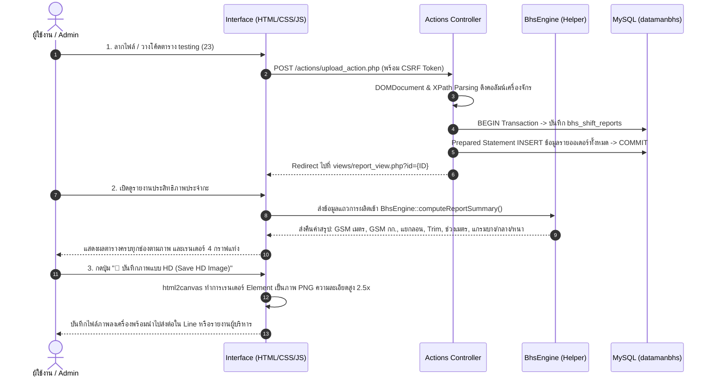

# BHS Corrugator Shift Performance Monitoring System
## ระบบติดตามและรายงานประสิทธิภาพการเดินงานเครื่องจักร BHS ประจำกะ

ระบบเว็บแอปพลิเคชันพัฒนาด้วย **Vanilla PHP (PHP 8.x)** และ **MySQL/MariaDB บน XAMPP** โดยใช้สถาปัตยกรรม **Modular / Lightweight MVC** เพื่อประมวลผล จัดเรียง และสรุปรายงานประสิทธิภาพการเดินงานของเครื่องจักรรีดลอนลูกฟูก BHS (Corrugator Machine) ประจำแต่ละกะ (กะ A, B, C) ได้อย่างแม่นยำ พร้อมระบบกรองข้อมูล (Filter) และบันทึกภาพรายงานความละเอียดสูงระดับ HD

---

## 1. ข้อมูลการเชื่อมต่อฐานข้อมูล (Database Connection)
- **Host:** `localhost`
- **Database Name:** `datamanbhs`
- **Username:** `root`
- **Password:** `(ว่าง)`
- **Driver:** PHP Data Objects (PDO) with Native Prepared Statements 100%
- **Charset:** `utf8mb4` (รองรับภาษาไทยสมบูรณ์แบบ)

---

## 2. บัญชีผู้ใช้งานเริ่มต้น (Default Credentials)
| บทบาท (Role) | ชื่อผู้ใช้ (Username) | รหัสผ่าน (Password) | สิทธิ์การใช้งาน |
| :--- | :--- | :--- | :--- |
| **Admin (ผู้ดูแลระบบ)** | `admin` | `123456` | สิทธิ์สูงสุด ดูรายงาน, นำเข้าไฟล์, แก้ไขเวลาสูญเสีย, เพิ่ม/ลบ/แก้ไขผู้ใช้งาน |
| **User (ผู้ใช้ทั่วไป)** | `user` | `123456` | ดูรายงานประสิทธิภาพ, นำเข้าไฟล์เครื่องจักร, บันทึกภาพรายงาน HD |

---

## 3. โครงสร้างไฟล์และโฟลเดอร์ (Project Structure)

```text
c:\xampp\htdocs\dataMACHINE\
├── config/                     # การตั้งค่าระบบหลักและความปลอดภัย
│   ├── database.php            # คลาสเชื่อมต่อ PDO แบบ Singleton, Prepared Statements 100%
│   ├── app.php                 # ค่าคงที่ระบบ, CSRF Protection, Thai Date Formatter, Sanitizer
│   └── auth.php                # Authentication Middleware (require_login, require_admin)
├── includes/                   # ส่วนประกอบ UI และคลาสคำนวณสถิติ
│   ├── header.php              # แถบเมนูด้านบน (ธีม ขาว-ส้ม), Responsive Full-width
│   ├── footer.php              # สคริปต์ Chart.js, html2canvas (บันทึกภาพ HD)
│   └── helpers.php             # BhsEngine: คำนวณ GSM เมตร, GSM น้ำหนัก, แยกลอน, Trim, ช่วงเมตร
├── actions/                    # ตัวประมวลผลคำสั่งฝั่ง Server (Controllers/Actions)
│   ├── auth_action.php         # จัดการ Login (password_verify) และ Logout
│   ├── upload_action.php       # อ่านไฟล์ HTML / ตารางที่วาง นำเข้าฐานข้อมูล Transaction
│   ├── report_action.php       # อัปเดตเป้าหมาย KPI, เวลาสูญเสียรายแผนก และลบรายงาน
│   └── user_action.php         # CRUD ผู้ใช้งาน (เพิ่ม ลบ แก้ไข รหัสผ่านแฮชด้วย password_hash)
├── views/                      # หน้าจอแสดงผลส่วนติดต่อผู้ใช้ (Views)
│   ├── login.php               # หน้าเข้าสู่ระบบ ธีม ขาว-ส้ม สะอาดตา
│   ├── dashboard.php           # หน้าหลักสรุปภาพรวม KPI และตารางรายงานประจำกะ
│   ├── upload.php              # หน้าโยนไฟล์ / วางโค้ด HTML ตารางเครื่องจักร BHS
│   ├── report_view.php         # หน้ารายงานฉบับเต็มตรงตามแบบภาพ (KPI, GSM, ลอน, Trim, 4 กราฟ)
│   └── users.php               # หน้าจัดการผู้ใช้ (เฉพาะ Admin)
├── assets/                     # สื่อและไฟล์ประกอบฝั่งไคลเอนต์
│   ├── css/
│   │   └── style.css           # ธีมสี ขาว-ส้ม (Orange & White), Full-width layout, ตารางสไตล์ BHS
│   └── js/
│       └── app.js              # สคริปต์บันทึกภาพ HD (html2canvas), Chart.js, Drag & Drop
├── index.php                   # จุดเริ่มต้นระบบ (Central Router)
└── sample_testing23.html       # ข้อมูลตัวอย่าง testing (23) ที่ได้รับมอบหมาย
```

---

## 4. แผนผังฐานข้อมูลและคำสั่ง SQL (Database Schema)

ระบบใช้งานตารางที่ออกแบบมาโดยเฉพาะสำหรับ BHS Corrugator Report และผูกความสัมพันธ์กับตาราง `users` เดิมใน `datamanbhs`:

```sql
-- 1. ตารางเก็บข้อมูลหัวรายงานกะและเป้าหมาย KPI
CREATE TABLE IF NOT EXISTS bhs_shift_reports (
    id INT AUTO_INCREMENT PRIMARY KEY,
    title VARCHAR(255) NOT NULL DEFAULT 'รายงานประสิทธิภาพการเดินงาน BHS',
    shift VARCHAR(10) NOT NULL DEFAULT 'B',
    report_date DATE NOT NULL,
    shift_end_time VARCHAR(50) DEFAULT '8.00',
    target_orders INT DEFAULT 120,
    target_meters DECIMAL(12,2) DEFAULT 68056.00,
    target_speed DECIMAL(8,2) DEFAULT 100.00,
    target_avg_meters DECIMAL(10,2) DEFAULT 500.00,
    target_time_total INT DEFAULT 720,
    target_time_run INT DEFAULT 675,
    target_loss_pct DECIMAL(5,2) DEFAULT 6.25,
    loss_details LONGTEXT COMMENT 'JSON เก็บเวลาสูญเสียรายแผนก (ผลิต, MC, ไฟฟ้า, ฯลฯ)',
    summary_notes TEXT COMMENT 'สรุปผลการเดินงาน',
    remarks TEXT COMMENT 'หมายเหตุ',
    raw_filename VARCHAR(255),
    created_by INT DEFAULT 1,
    created_at DATETIME DEFAULT CURRENT_TIMESTAMP,
    updated_at DATETIME DEFAULT CURRENT_TIMESTAMP ON UPDATE CURRENT_TIMESTAMP
) ENGINE=InnoDB DEFAULT CHARSET=utf8mb4 COLLATE=utf8mb4_unicode_ci;

-- 2. ตารางเก็บข้อมูลการผลิตรายออเดอร์ของเครื่องจักร BHS
CREATE TABLE IF NOT EXISTS bhs_production_records (
    id INT AUTO_INCREMENT PRIMARY KEY,
    report_id INT NOT NULL,
    seq_no INT DEFAULT 0,
    shift VARCHAR(10) DEFAULT '',
    plan_order VARCHAR(50) DEFAULT '',
    order_no VARCHAR(50) DEFAULT '',
    wo_no VARCHAR(100) DEFAULT '',
    wo_prefix VARCHAR(20) DEFAULT '',
    flute VARCHAR(20) DEFAULT '',
    m1_weight DECIMAL(12,3) DEFAULT 0.000,
    m2_weight DECIMAL(12,3) DEFAULT 0.000,
    m3_weight DECIMAL(12,3) DEFAULT 0.000,
    m4_weight DECIMAL(12,3) DEFAULT 0.000,
    m5_weight DECIMAL(12,3) DEFAULT 0.000,
    m1_paper VARCHAR(50) DEFAULT '',
    m2_paper VARCHAR(50) DEFAULT '',
    m3_paper VARCHAR(50) DEFAULT '',
    m4_paper VARCHAR(50) DEFAULT '',
    m5_paper VARCHAR(50) DEFAULT '',
    m1_gsm INT DEFAULT 0,
    m2_gsm INT DEFAULT 0,
    m3_gsm INT DEFAULT 0,
    m4_gsm INT DEFAULT 0,
    m5_gsm INT DEFAULT 0,
    paper_width_mm DECIMAL(10,2) DEFAULT 0.00,
    sheet_length_mm DECIMAL(10,2) DEFAULT 0.00,
    sheet_weight_kg DECIMAL(10,6) DEFAULT 0.000000,
    good_big_sheets INT DEFAULT 0,
    waste_big_sheets INT DEFAULT 0,
    knife_t INT DEFAULT 0,
    knife_s DECIMAL(10,2) DEFAULT 0.00,
    trim_mm DECIMAL(10,2) DEFAULT 0.00,
    f1 INT DEFAULT 0, f2 INT DEFAULT 0, f3 INT DEFAULT 0,
    f4 INT DEFAULT 0, f5 INT DEFAULT 0, f6 INT DEFAULT 0,
    total_small_sheets INT DEFAULT 0,
    good_small_sheets INT DEFAULT 0,
    start_time DATETIME NULL,
    end_time DATETIME NULL,
    production_seconds INT DEFAULT 0,
    stop_count INT DEFAULT 0,
    stop_time_sec INT DEFAULT 0,
    stack_count INT DEFAULT 0,
    avg_speed DECIMAL(10,2) DEFAULT 0.00,
    total_weight_kg DECIMAL(12,4) DEFAULT 0.0000,
    total_area_sqm DECIMAL(12,2) DEFAULT 0.00,
    total_length_m DECIMAL(12,2) DEFAULT 0.00,
    total_volume_sqm DECIMAL(12,3) DEFAULT 0.000,
    created_at DATETIME DEFAULT CURRENT_TIMESTAMP,
    INDEX idx_report (report_id),
    INDEX idx_shift (shift),
    INDEX idx_flute (flute),
    INDEX idx_wo (wo_prefix),
    CONSTRAINT fk_bhs_report FOREIGN KEY (report_id) REFERENCES bhs_shift_reports (id) ON DELETE CASCADE
) ENGINE=InnoDB DEFAULT CHARSET=utf8mb4 COLLATE=utf8mb4_unicode_ci;
```

---

## 5. แผนภาพขั้นตอนการทำงาน (Flow Diagram)



---

## 6. ฟังก์ชันหลักของระบบ (Core Features)

1. **นำเข้าข้อมูลเครื่องจักร (Smart Machine Data Ingestion):**
   - รองรับการลากไฟล์มาวาง (Drag & Drop) ไฟล์ HTML ที่ได้จากเครื่อง BHS
   - รองรับการคัดลอกโค้ด HTML Table มาแปะลงในกล่องข้อความ
   - มีปุ่ม **"โหลดข้อมูลตัวอย่าง testing (23)"** ให้กดทดสอบได้ทันทีเพียงคลิกเดียว
2. **จัดเรียงและคำนวณตรงตามภาพรายงาน BHS 100%:**
   - **ตาราง KPI แผนก:** Order Start/Finish, เดินทั้งหมด+ซ่อม, เมตรเฉลี่ย, Speed เฉลี่ยหัก/ไม่หักสูญเสีย, เวลาเดินจริง, เวลาสูญเสียรายแผนก (ผลิต, MC, ไฟฟ้า, คลังม้วน, ม้วน, Utility, Packing, กาว, วางแผน, จัดส่ง, เปลี่ยนลอน, PM)
   - **ตาราง GSM เมตร (M1 - M5):** คำนวณเมตรกระดาษแยกตามเกรดแกรม (100 - 270 GSM)
   - **ตาราง GSM น้ำหนัก (M1 - M5):** สรุปน้ำหนักกิโลกรัมจริงแยกตามเกรดแกรม
   - **ตารางรายการที่ต้องการ (แยกตามลอน):** ลอน B, C, BC, A, AB, E (จำนวนออเดอร์, เมตร, เวลาผลิต, น้ำหนัก และ %)
   - **ตารางช่วงระยะเมตร & ตาราง Trim:** สรุปความถี่ของระยะความยาวและขอบ Trim สูญเสีย
   - **4 กราฟแท่งแสดงผล:** เวลาสูญเสียรายแผนก, % น้ำหนักแยกลอน, % น้ำหนักแกรม (บาง/กลาง/หนา), % จำนวนเมตร
3. **ระบบตัวกรองแบบโต้ตอบ (Interactive Filter):**
   - กรองตามกะ (Shift: All, A, B, C)
   - กรองตามลอน (Flute: B, C, BC, A, AB, E)
   - กรองตามประเภทงาน (Wo Prefix: PDR, PDW, PDF, PDW, ฯลฯ)
4. **บันทึกภาพแบบ HD (High-Definition Image Export):**
   - บันทึกภาพรายงานทั้งหมดได้ในคลิกเดียวผ่าน `html2canvas` ด้วยตัวคูณความละเอียด `scale: 2.5` ให้ภาพคมชัดระดับ HD พร้อมใช้งานพิมพ์หรือส่งสรุปรายงาน
5. **ระบบจัดการผู้ใช้ (User Management สำหรับ Admin):**
   - เพิ่ม ลบ แก้ไขสิทธิ์ผู้ใช้งาน และรีเซ็ตรหัสผ่าน (เข้ารหัสด้วย `password_hash()`)
6. **เชื่อมต่อและจัดเก็บข้อมูลผ่าน Google Sheets (Google Sheets Integration):**
   - ส่งข้อมูลสรุปกะ, วันที่, เมตร, น้ำหนัก, ความเร็ว, เวลาสูญเสีย, คะแนน KPI, และข้อความสรุปผล เข้าสู่ Google Sheets ทันที
   - รองรับทั้งการซิงค์อัตโนมัติ (Auto Sync) เมื่อบันทึก และปุ่มกดส่งด้วยตนเองในหน้ารายงาน
   - ตรวจจับข้อมูลซ้ำ (วันที่ + กะ + เครื่อง) อัตโนมัติ โดยจะอัปเดตแถวเดิมแทนการเพิ่มซ้ำ

---

## 7. การเชื่อมต่อ Google Sheets (Google Sheets Setup)

ระบบใช้ **Google Apps Script Web App** เป็นตัวรับข้อมูล (Webhook) ซึ่งง่าย ปลอดภัย ไม่ต้องเปิด Google Cloud API หรือสร้าง Service Account ให้ยุ่งยาก

### ขั้นตอนการตั้งค่า:
1. เปิด [Google Sheets](https://sheets.new) ขึ้นมา 1 ไฟล์
2. ไปที่เมนู **ส่วนขยาย (Extensions)** -> **Apps Script**
3. ลบโค้ดเดิมในโปรเจกต์ออก แล้วคัดลอกโค้ดทั้งหมดจากไฟล์ `google_sheet_app_script.js` ไปวาง
4. กดบันทึก (รูปแผ่นดิสก์)
5. กดปุ่ม **ทำให้ใช้งานได้ (Deploy)** ด้านบนขวา -> เลือก **การทดสอบใช้งานใหม่ (New deployment)**
6. คลิกไอคอนรูปเฟือง ⚙️ เลือกประเภทเป็น **เว็บแอป (Web app)**
7. ตั้งค่าดังนี้:
   - **คำอธิบาย:** dataMACHINE Webhook
   - **ดำเนินการในฐานะ (Execute as):** ฉัน (Me)
   - **ผู้มีสิทธิ์เข้าถึง (Who has access):** ทุกคน (Anyone)  *(สำคัญมาก)*
8. กดปุ่ม **ทำให้ใช้งานได้ (Deploy)** และอนุมัติสิทธิ์ (Authorize access) ให้เรียบร้อย
9. คัดลอก **URL เว็บแอป (Web app URL)** (ที่ขึ้นต้นด้วย `https://script.google.com/macros/s/.../exec`)
10. เปิดไฟล์ `config/google_sheet.php` ในโปรเจกต์ แล้วนำ URL มาวางที่:
    ```php
    define('GOOGLE_SHEET_WEBHOOK_URL', 'https://script.google.com/macros/s/.../exec');
    ```
11. เมื่ออัปโหลดไฟล์รายงานหรือกดปุ่ม **"📊 ส่งไป Google Sheets"** ในหน้ารายงาน ข้อมูลจะวิ่งเข้าสู่ Google Sheet ทันที!

---

## 8. การนำขึ้น GitHub (GitHub Setup)

โปรเจกต์ได้จัดเตรียมไฟล์ `.gitignore` และตั้งค่า Git Repository เรียบร้อยแล้ว

```bash
# 1. ตรวจสอบสถานะไฟล์
git status

# 2. เพิ่มไฟล์และทำ Commit
git add .
git commit -m "feat: BHS Performance System with Google Sheets & HD Export"

# 3. เชื่อมต่อกับ GitHub Repository ของคุณ (เปลี่ยน URL เป็นของตัวเอง)
git remote add origin https://github.com/USERNAME/REPOSITORY.git

# 4. Push โค้ดขึ้น GitHub
git branch -M main
git push -u origin main
```
